# Let-me-ask

Простая игра викторина

Используемый стэк: 
Storyboard, 
UIkit

Реализованы функции:

- Паттерн "Singleton"
сохранение игровой сессии

- Паттерн "Memento"
сохранение имени пользователя
сохранение истории побед/поражений

- Паттерн "Memento" и "Builder"
сохранение пользовательских вопросов на устройстве

- Паттерн "Strategy"
выбор порядка вопросов
выбор пользовательских вопросов

- Паттерн "Observer"
отображение текущего вопроса

- Паттерн "Facade"
реализация кнопок-подсказок

- Паттерн "FlyWeight"
некоторые детали дизайна

Главное меню
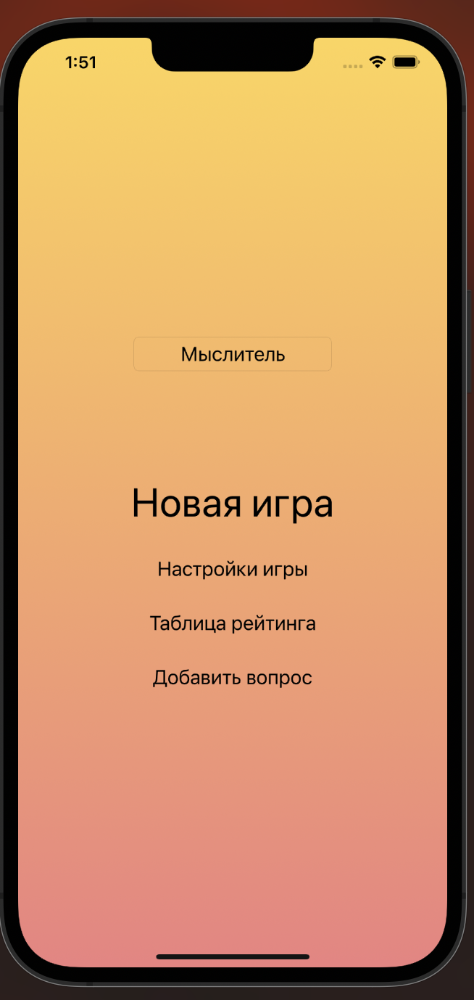

Выбор имени (своё или по-умолчанию)
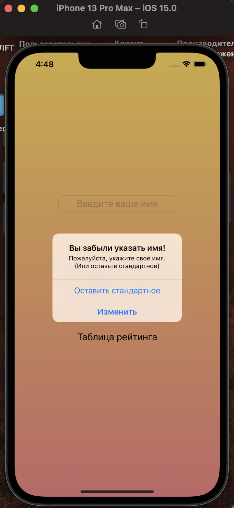

Выбор параметров игры
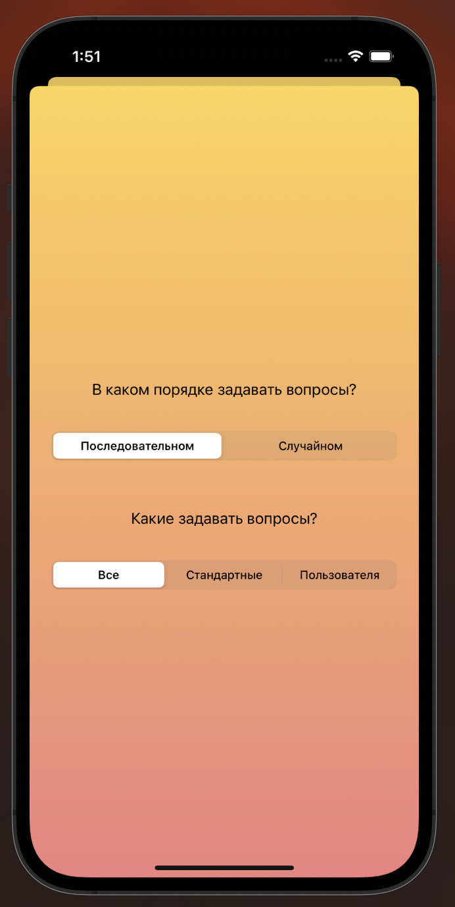

Таблица результатов
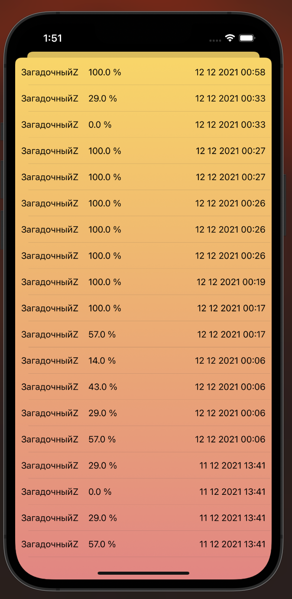

Форма ввода вопроса
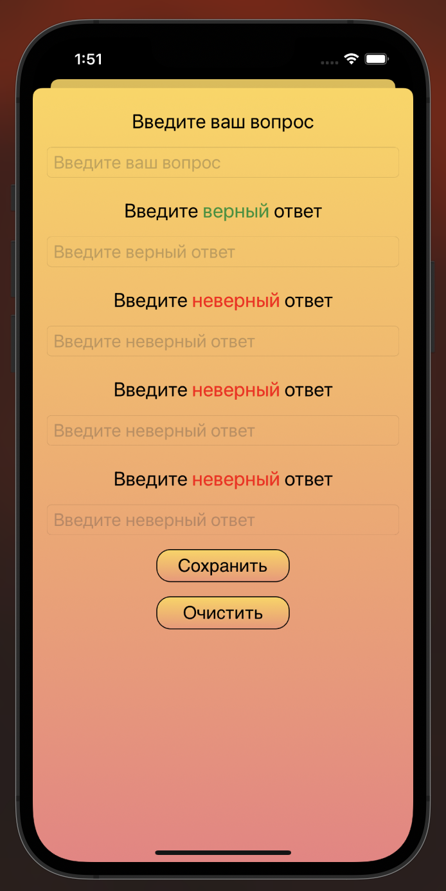

Игра
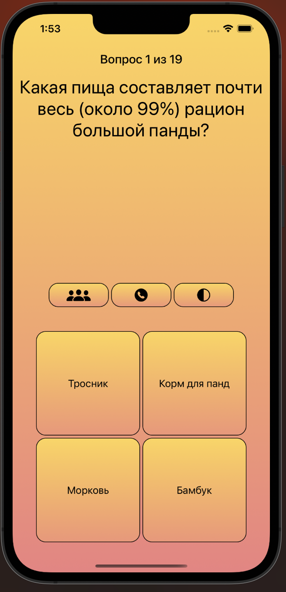

Подсказка "Помощь зала"
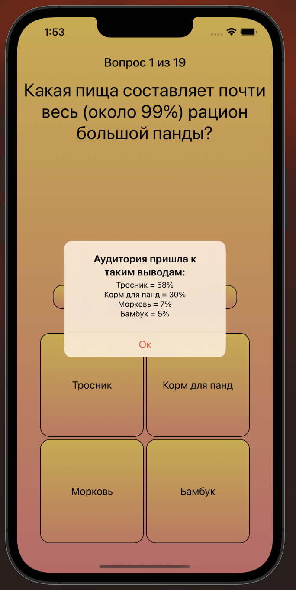

Подсказка "Звонок другу"
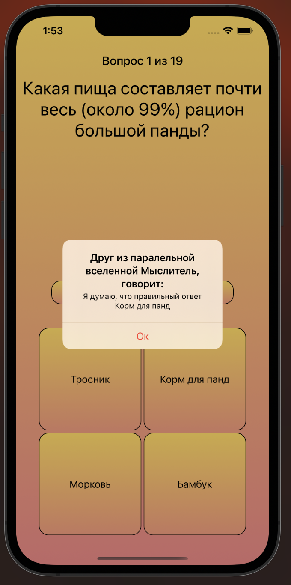

Подсказка "50/50"
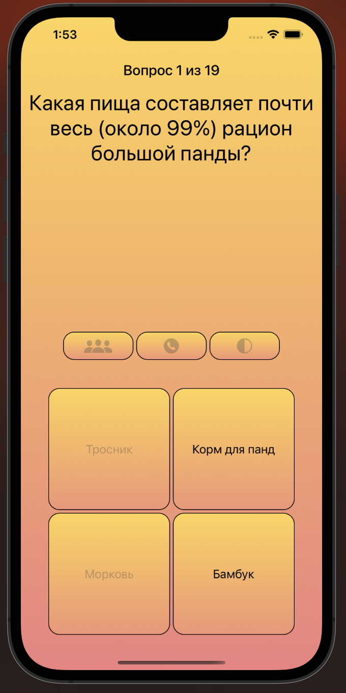

Подсказки используются только 1 раз за игру
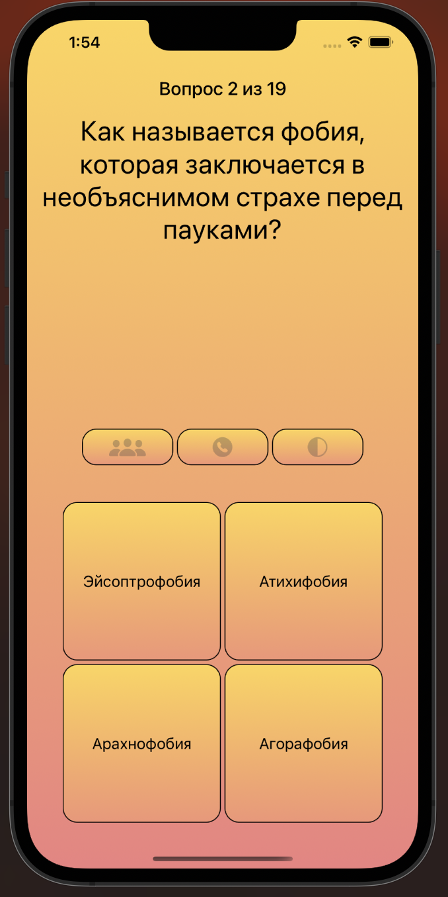

Так выглядит победа
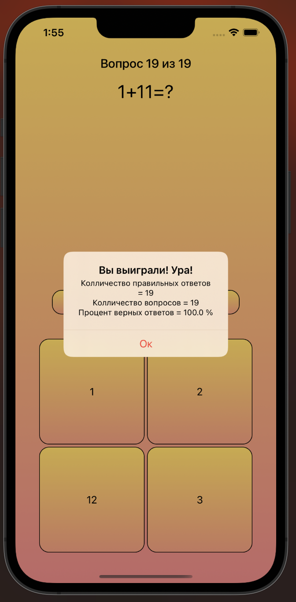
